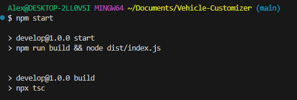
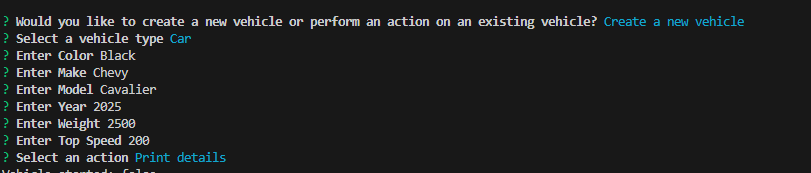
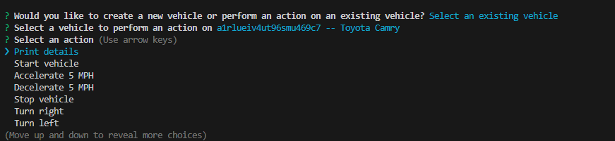
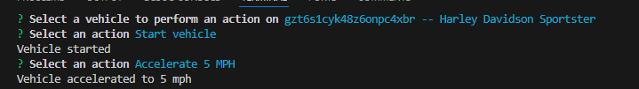

# Vehicle Customizer

## Description

This project is of a vehicle builder using the command-line application to prompt questions about details of the vehicle and responses. Once a vehicle has been created, actions can be performed for the vehicle.

This project uses command-line as an interface, TypeScript programming and Object-Oriented-Programming concept.

This project demonstrates an application on how to take user input and create an object with a list of features.

## Table of Contents

- [Installation](#installation)
- [Usage](#usage)
- [Credits](#credits)
- [Features](#features)

## Installation

Perform "npm i" in command line to install all necessary packages.

## Usage

Below is a link to a walkthrough video that demonstrates how to run and use this project.
- [Walkthrough-Video](https://drive.google.com/file/d/1ChQXEQ76SFvBhAYCrPfJRixZ0wBGeeva/view)

When program is invoked, two options can be selected. Create a vehicle or select an existing vehicle. Create a vehicle, will prompt questions for the user to put in responses to create a vehicle. If there are existing vehicles, those can be selected. Once a vehicle has been created or selected, actions can be performed onto the vehicle until user decides to exit the program.

How to call program:

Prompt after program is invoked:

List of Actions after vehicle generated/selected:

Action selected:

## Credits

Tutor and Copilot help to develop then option in Cli.ts file for if Tow or Wheelie options were selected actions.

Below is my GitHub profile. Any suggestions to improve functionality and code, feel free to reach out to me!

GitHub: https://github.com/AVue00

## Features

Command-Line was used to execute the program. TypeScript was the language used and the inquirer package was also used as part of programming the prompt.